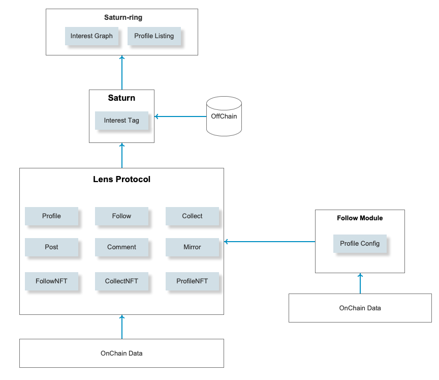

# Project Overview
### Overview
Saturn is a visual interest graph product based on social relations and user behavior build on Lens Protocol. By analyzing the behaviors of users and topics of interest, it generates a user's social relationship graph and interest graph and recommends people and topics that may be of interest. At the same time, users can manage their own relationships and set conditions for following, commenting, and forwarding, such as whether to charge or specify Follow NFT ID.

### Integration
We will deploy lens protocol and follow module on polygon chain first.With the development of Saturn ecology, we will deploy on BNBChain, ethereum in the future.

# Project Details
### Architecture

### Saturn-ring
Saturn-ring is the front-end presentation layer of 
Saturn. Saturn-ring will display the interest social 
graph in a visual form, and will display the user's Profile information. 
The Saturn-ring will connect to the Metamask wallet, 
and also provide a web-page for users to create a Profile, perform Follow 
operations, etc.

### Saturn
Saturn is back-end service, it has its off-chain storage. Saturn will call Lens Protocol to access the social data.
It provides the createProfile, follow, configProfile interface.
When user create profile, Saturn will bind interest tags to the profileID and store the interest data to mysql database.
Saturn-ring can query the interest graph by querying the interest tags which stored in the mysql database. 

### Lens Protocol & Follow Module
We will deploy the follow module for the lens protocol
to call. User can configure the Profile after creating 
the Profile. Each user can configure different 
parameters. For example, user can 
set other users need to pay when they follow. 
Of course, these parameters can be updated 
at any time after setting.

